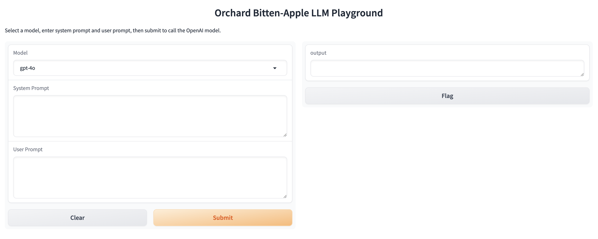

# Bitten Apple

Bitten-apple is the prototype validation and presentation tools for LLM projects.

You can share your LLM models like GTP-4o without exposing your API keys.



## Usage

Create `.env` file or set environment variables.

```
OPENAI_BASE_URL=https://api.gptsapi.net/v1
OPENAI_API_KEY=sk-xxx
```

Start the gradio server.

```
python ./gradio_app.py
```
